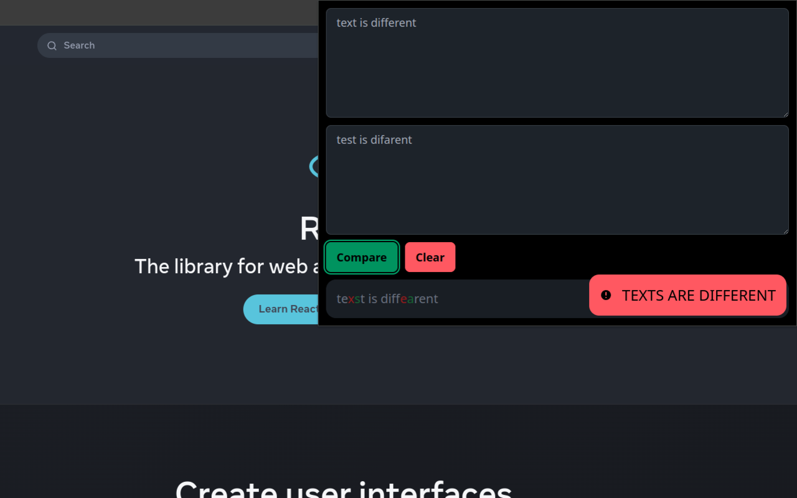

Text Compare is modern, open-source <b>Chrome</b> / <b>Firefox</b> extension. It uses <b>React</b>, <b>Typescript</b> and <b>Scss</b> as a base and has build-in supports of <b>Tailwind Css</b> and <b>Browser Extension polyfill</b> for better development experience.

## Features

It can compare two texts in popup widow without entering a new site, also you can select any text on website and compare it thought the browser context menu, yes that's really that simple...

## Download

You can download this extension for [Chrome](https://chromewebstore.google.com/detail/ofnnoijleohfbahefkogohahdnjodaff) or [Firefox](https://addons.mozilla.org/en-US/firefox/addon/compare-text)

Also it can be built from source:

- clone repository
- run `npm install`
- then `npm run build`
- load unpacked /build folder in extensions page or use zip file in /zip folder

## References

Used template: [browser-extension-boilerplate-typescript-react](https://github.com/KovalchukDanil0/browser-extension-boilerplate-typescript-react) based on [chrome-extension-boilerplate-react](https://github.com/lxieyang/chrome-extension-boilerplate-react)
